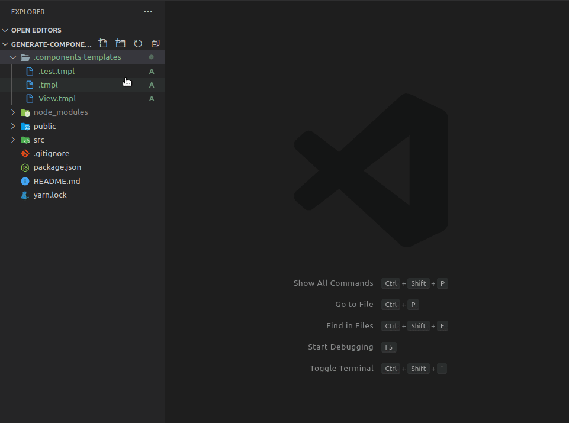

<h1 align="center">Generate Components from Templates 🚀</h1>

A visual studio code extension for you to generate the any components from template files.

<p align="center">
  
</p>

## First steps:

1. Create a folder named `.components-templates` in your application's root directory.

2. Create your files with the extension `.tmpl` in the folder `.components-templates` with a tag `{component_name` to be replaced with the chosen name of your component, for example:

```jsx
import React from "react";

export default function {component_name}(){
  return <h2>{component_name}</span>;
}
```

## Usage

<p align="center">
  
</p>

## Extension Settings

This extension contributes the following settings:

- `generate-component-from-template.path-file-templates`: Path where your template files are located. Tip: Place at the root of the project.

- `generate-component-from-template.component-name`: Variable that will be used to name your competent and their respective files. Tip: Use between braces.

- `generate-component-from-template.files-extension`: Extension of the generated files.

- `generate-component-from-template.generate-index-export`: If true, it will generate an index file for standard component export.
